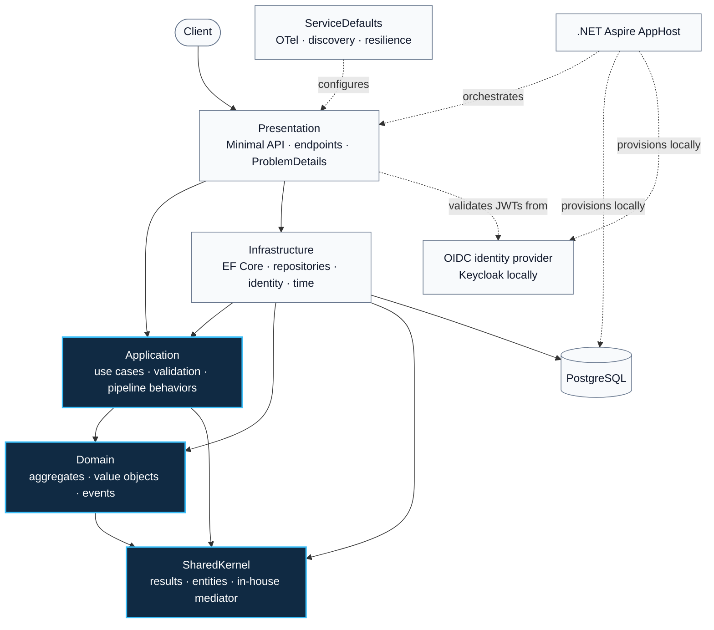
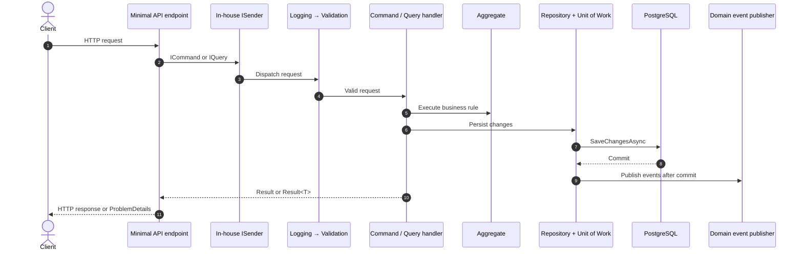
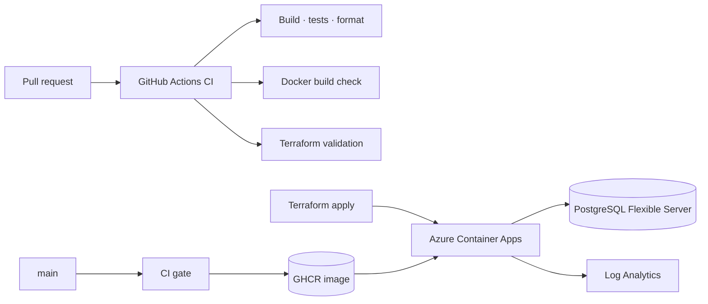

<div align="center">


# .NET Clean Architecture

**A production-shaped reference for building maintainable .NET APIs with enforced boundaries.**

[](https://dotnet.microsoft.com/)
[](#architecture)
[](https://learn.microsoft.com/dotnet/aspire/)
[](https://www.postgresql.org/)
[](https://opentelemetry.io/)
[](#quality-gates)
[](LICENSE)

[Architecture](#architecture) · [Request flow](#request-flow) · [Run](#run-it) · [Auth](#authentication) · [Project map](#project-map) · [Delivery](#delivery)

</div>

> [!IMPORTANT]
> This is a complete reference implementation to study and adapt—not a `dotnet new` template.

## ✨ At a glance

| Area | What is implemented |
|---|---|
| **Architecture** | Clean Architecture, CQRS-style commands/queries, inward-only dependencies |
| **Domain** | Aggregates, value objects, domain events, `Result` / `Result<T>` |
| **API** | ASP.NET Core Minimal APIs, endpoint discovery, RFC 7807, OpenAPI + Scalar |
| **Data** | EF Core 10, PostgreSQL, migrations, auditing, soft delete via a named global query filter, optimistic concurrency |
| **Platform** | .NET Aspire, OpenTelemetry, Docker, Azure Container Apps, Terraform |
| **Quality** | xUnit v3, Shouldly, NSubstitute, NetArchTest, warnings as errors |

## 🏗️ Architecture



| Project | Owns | May depend on |
|---|---|---|
| `SharedKernel` | Results, base entities, mediator primitives | — |
| `Domain` | Business rules and product aggregate | `SharedKernel` |
| `Application` | Commands, queries, handlers, validation | `Domain`, `SharedKernel` |
| `Infrastructure` | Persistence and external concerns | `Application`, `Domain`, `SharedKernel` |
| `Presentation` | HTTP composition root and endpoints | Application layers + `ServiceDefaults` |

The dependency rules are executable: `CleanArchitecture.ArchitectureTests` rejects invalid layer references and convention drift.

## 🔄 Request flow



- No MediatR dependency: `SharedKernel.Messaging` provides the mediator and pipeline.
- Expected failures travel as typed results; exceptions are handled globally.
- Domain events are dispatched by an EF Core interceptor **after** a successful commit.

## 🚀 Run it

**Prerequisites:** [.NET SDK 10.0.302](https://dotnet.microsoft.com/download/dotnet/10.0), Docker, and the [Aspire CLI](https://learn.microsoft.com/dotnet/aspire/cli/overview) for the recommended path.

> [!NOTE]
> The API applies any pending EF Core migrations automatically at startup (and does nothing if the database is already up to date), so a fresh database is ready to use as soon as the API is reachable — no manual step required.

### 🟣 Aspire — recommended

```bash
aspire run
```

Starts the API, PostgreSQL, Keycloak, and the Aspire dashboard with logs, traces, and metrics.

### 🐳 Docker Compose

```bash
docker compose up --build
```

| Resource | URL |
|---|---|
| API | `http://localhost:8080` |
| Scalar API reference | `http://localhost:8080/scalar/v1` |
| OpenAPI document | `http://localhost:8080/openapi/v1.json` |
| Keycloak (admin console `admin` / `admin`, dev only) | `http://localhost:8180` |

<details>
<summary><strong>Run with a separate PostgreSQL instance</strong></summary>

```bash
dotnet run --project src/CleanArchitecture.Presentation
```

Set `ConnectionStrings:Database` through configuration or user secrets before starting the API. The API applies pending migrations itself on startup, so this is enough for a fresh database.

To apply migrations explicitly instead — e.g. in CI, or to control exactly when they run — use `dotnet ef` directly:

```bash
dotnet tool restore
dotnet ef database update \
  --project src/CleanArchitecture.Infrastructure \
  --startup-project src/CleanArchitecture.Infrastructure
```

</details>

## 🔌 API surface

| Method | Route | Purpose | Requires |
|---|---|---|---|
| `GET` | `/api/products` | List products with pagination | Authenticated user |
| `GET` | `/api/products/{id}` | Get one product | Authenticated user |
| `POST` | `/api/products` | Create a product | `products:write` scope |
| `PUT` | `/api/products/{id}` | Update a product | `products:write` scope |
| `DELETE` | `/api/products/{id}` | Soft-delete a product (then reads as `404`) | `products:write` scope |

## 🔐 Authentication

Provider-agnostic JWT bearer tokens (`Microsoft.AspNetCore.Authentication.JwtBearer`), configured from `Authentication:Schemes:Bearer`. Without a configured issuer the API still starts and protected calls return `401`.

**Secure by default** — an authorization fallback policy requires an authenticated user on every endpoint that declares nothing, so a new endpoint is never accidentally public. Public routes are opt-in via `AllowAnonymous()`: the health probes (`/health`, `/alive`), the OpenAPI document, and Scalar (Development only). A convention test pins that allow-list, and the OpenAPI document declares `401` (plus `403` for scoped operations) on every protected operation.

- Write endpoints require a `scope` claim containing `products:write` (space-delimited or one claim per scope).
- Inbound claim mapping is disabled, so `sub` is the audited user id.
- `401` and `403` are RFC 9457 `application/problem+json` responses like every other error; `401` keeps the `WWW-Authenticate` challenge.

### Local: Keycloak (Docker Compose and Aspire)

Both setups start Keycloak on port `8180` and import the realm-as-code in [`deploy/keycloak/clean-architecture-realm.json`](deploy/keycloak/clean-architecture-realm.json). Access tokens carry `aud = clean-architecture-api` and the granted scopes in `scope`.

| | Docker Compose | Aspire |
|---|---|---|
| Keycloak / issuer | `http://localhost:8180/realms/clean-architecture` | `https://localhost:8180/realms/clean-architecture` (dev certificate) |
| Scalar | `http://localhost:8080/scalar/v1` | `http://localhost:5236/scalar/v1` |

> [!WARNING]
> Every credential in the realm file and the compose file is a **dev-only** value, committed on purpose. Never reuse them.

| Client | Grant | Proves |
|---|---|---|
| `clean-architecture-service` / `dev-only-service-secret` | Client credentials, `products:write` by default | Reads and writes succeed (`201`/`200`) |
| `clean-architecture-reader` / `dev-only-reader-secret` | Client credentials, no scope | Reads succeed, writes return `403` |
| `scalar` (public) + user `alice` / `alice` | Authorization Code + PKCE, `products:write` optional | Interactive sign-in from Scalar |

```bash
TOKEN=$(curl -s http://localhost:8180/realms/clean-architecture/protocol/openid-connect/token \
  -d grant_type=client_credentials \
  -d client_id=clean-architecture-service -d client_secret=dev-only-service-secret | jq -r .access_token)

curl -i http://localhost:8080/api/products -H "Authorization: Bearer $TOKEN"
```

- **Scalar** — open the reference, choose the `OAuth2` scheme, and sign in as `alice`. The flow comes from the optional `OpenApi:OAuth2` section (`AuthorizationUrl`, `TokenUrl`, `ClientId`); when it is not set, Scalar only offers the Bearer field.
- **`.http` file** — `CleanArchitecture.Presentation.http` requests a Keycloak token first and reuses it as `{{token}}`.
- **Issuer inside Compose** — the API fetches signing keys from `http://keycloak:8080` (`Authority`), while tokens requested from the host are issued by `http://localhost:8180`: Keycloak's `KC_HOSTNAME` pins the issuer and `KC_HOSTNAME_BACKCHANNEL_DYNAMIC` keeps the key endpoints on the internal name. `RequireHttpsMetadata=false` is set only by the local orchestrators.

### Local: API alone with `dotnet user-jwts`

Running just `dotnet run --project src/CleanArchitecture.Presentation` needs no identity provider. Mint a token with the built-in tool (it stores the signing key in user secrets and writes the issuer/audience to `appsettings.Development.json`):

```bash
dotnet user-jwts create --project src/CleanArchitecture.Presentation --scope products:write
```

Omit `--scope` for a read-only token.

### Production

Point the API at your identity provider through configuration (environment variables use `__` separators):

| Key | Purpose |
|---|---|
| `Authentication__Schemes__Bearer__Authority` | Issuer URL; signing keys are discovered from its OIDC metadata |
| `Authentication__Schemes__Bearer__ValidAudiences__0` | Audience the API accepts (add `__1`, … for more) |
| `Authentication__Schemes__Bearer__ValidIssuer` | Optional; only when the token `iss` differs from `Authority` |

## 🗂️ Project map

```text
src/
├── CleanArchitecture.SharedKernel      # Results, entities, mediator
├── CleanArchitecture.Domain            # Product aggregate and domain rules
├── CleanArchitecture.Application       # Use cases and pipeline behaviors
├── CleanArchitecture.Infrastructure    # EF Core, PostgreSQL, repositories
├── CleanArchitecture.Presentation      # Minimal API, OpenAPI, Scalar
├── CleanArchitecture.ServiceDefaults   # OTel, discovery, resilience
└── CleanArchitecture.AppHost           # Aspire orchestration
tests/
├── *.UnitTests                         # Layer-focused tests
├── CleanArchitecture.IntegrationTests  # HTTP end to end against real PostgreSQL
└── CleanArchitecture.ArchitectureTests # Dependency and convention rules
deploy/keycloak/                        # Local Keycloak realm as code (dev only)
terraform/                              # Azure Container Apps + PostgreSQL
```

## ✅ Quality gates

```bash
dotnet build CleanArchitecture.slnx
dotnet test CleanArchitecture.slnx
dotnet format CleanArchitecture.slnx --verify-no-changes
```

`CleanArchitecture.IntegrationTests` starts a PostgreSQL container with Testcontainers, so Docker must be running for `dotnet test`.

Coverage report (HTML + Markdown summary in `TestResults/coverage-report`):

```bash
dotnet tool restore && dotnet test CleanArchitecture.slnx --coverage --coverage-output-format cobertura --coverage-settings CodeCoverage.config --results-directory TestResults && dotnet reportgenerator "-reports:TestResults/*.cobertura.xml" "-targetdir:TestResults/coverage-report" "-reporttypes:HtmlInline;Cobertura;MarkdownSummaryGithub"
```

| Gate | Coverage |
|---|---|
| Build | Nullable enabled, analyzers, deterministic output, warnings as errors |
| Tests | **224 tests** across six projects |
| Architecture | Layer, handler, repository, command/query, and mediator conventions |
| CI | Build, test, formatting, Docker build, Terraform format + validation |
| Supply chain | Vulnerable NuGet package gate (incl. transitive), CodeQL (C# + workflows), weekly grouped Dependabot updates |

## 📦 Delivery



- Pushes to `main` publish SHA and `latest` images to GHCR after CI succeeds.
- `terraform/` provisions Azure Container Apps, PostgreSQL Flexible Server, and Log Analytics.
- OTLP export is enabled whenever `OTEL_EXPORTER_OTLP_ENDPOINT` is configured.
