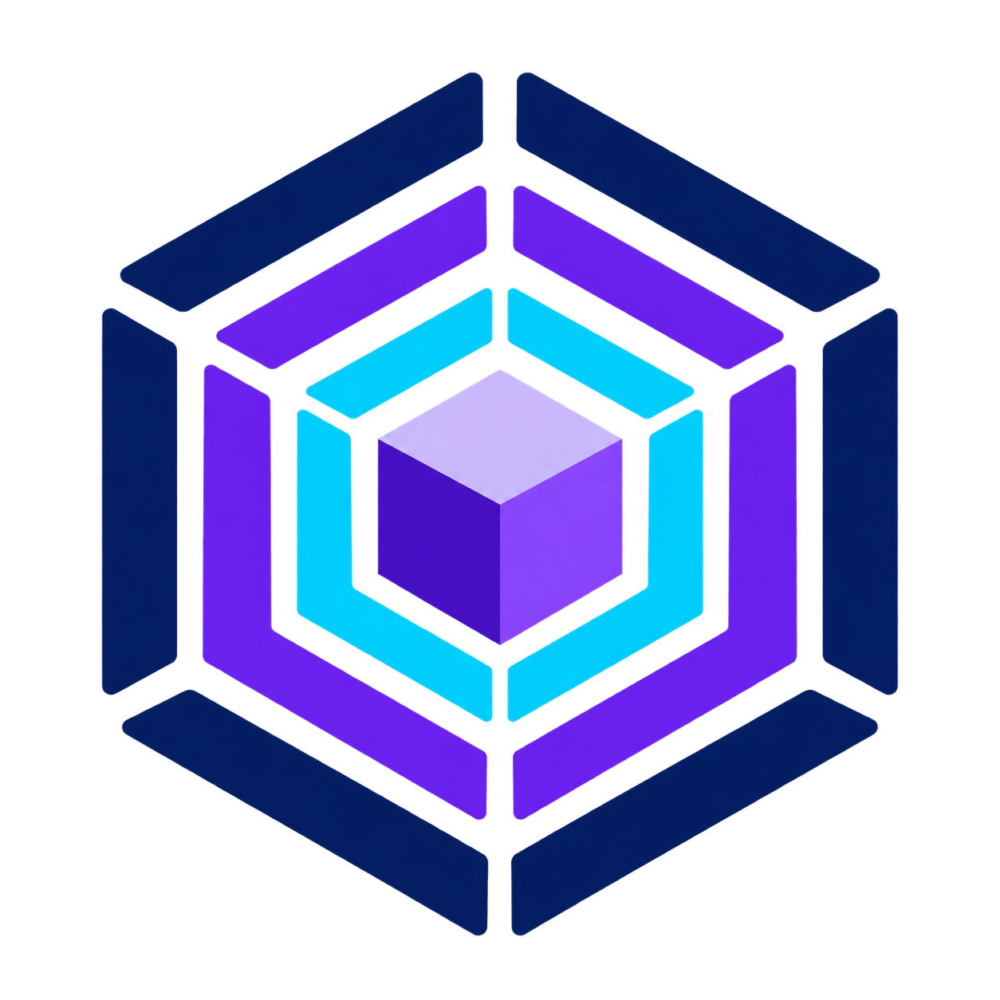
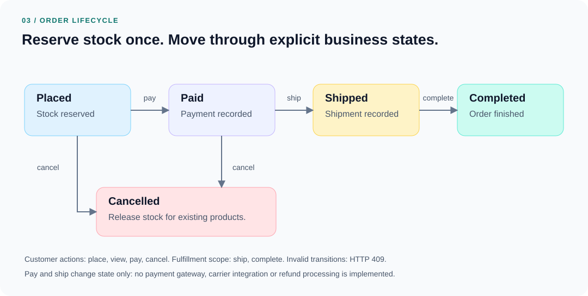
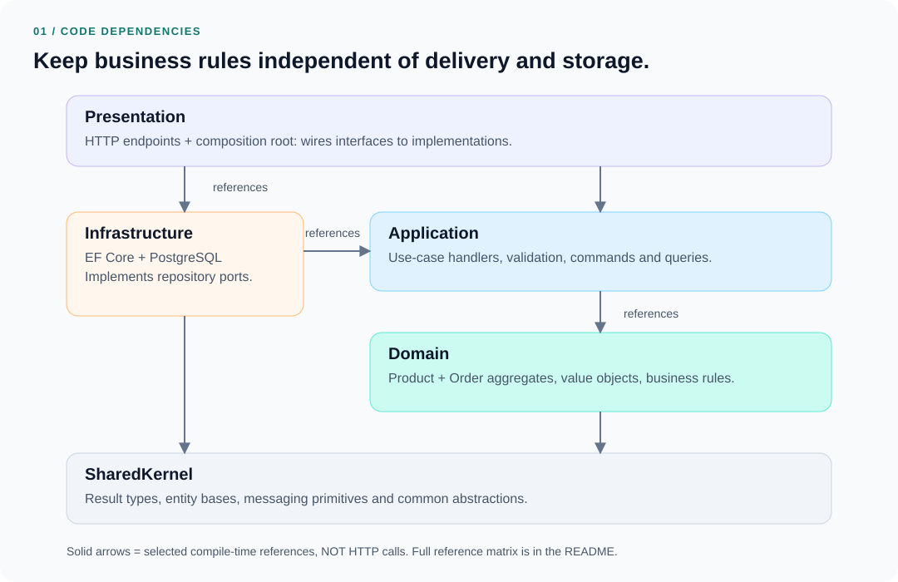
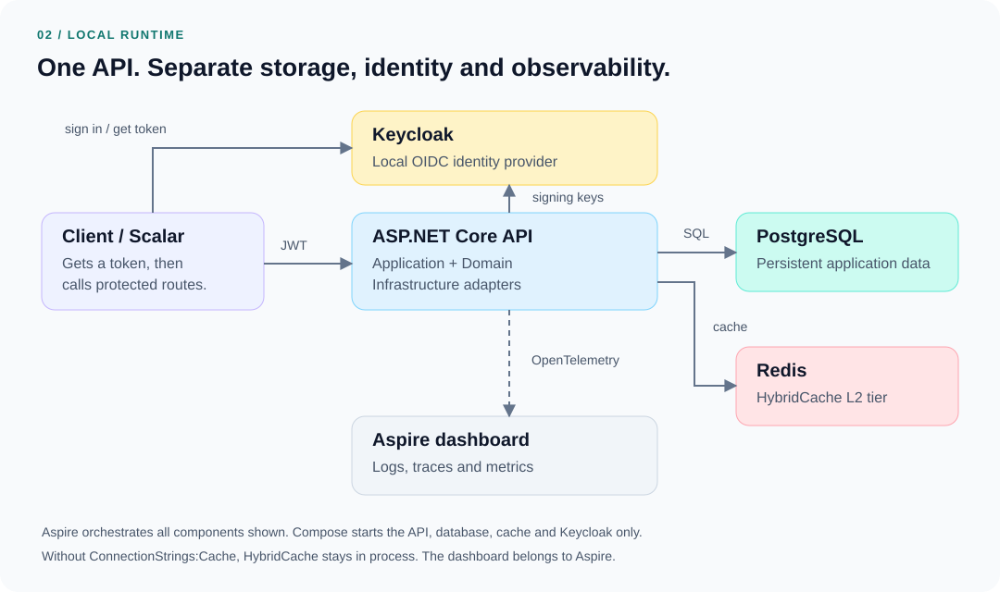
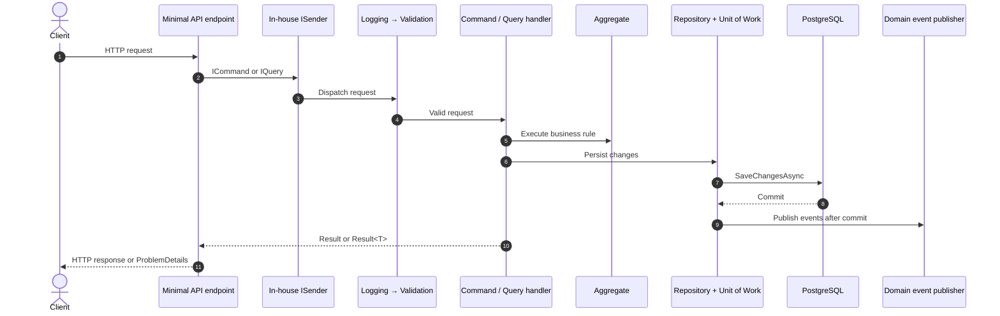
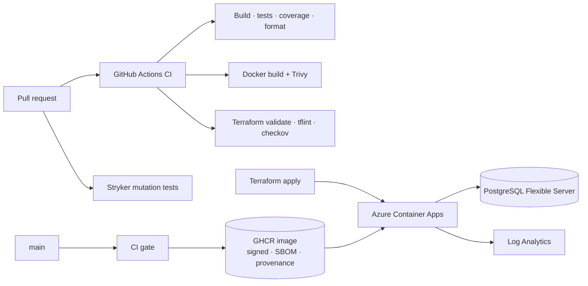

<div align="center">



# .NET Clean Architecture

**Learn Clean Architecture through a working product catalog, inventory and order API.**

[](https://dotnet.microsoft.com/)
[](#architecture)
[](https://aspire.dev/)
[](https://www.postgresql.org/)
[](https://opentelemetry.io/)
[](https://github.com/mbarretot/dotnet-clean-architecture/actions/workflows/ci.yml)
[](#quality-gates)
[](LICENSE)

[Use cases](#what-you-can-do-today) · [Run locally](#run-it) · [Technologies](#technology-stack) · [Architecture](#architecture) · [API](#api-surface) · [Decisions](docs/adr/README.md)

</div>

> [!IMPORTANT]
> An API-first reference implementation to study and adapt—not a `dotnet new` template, a storefront, or a complete commerce platform.

Build a catalog, reserve inventory and follow orders through fulfillment. This reference connects **business rules, HTTP endpoints and PostgreSQL**, with architecture tests enforcing layer boundaries.

## What you can do today

| Use case | Implemented behavior | Who can do it |
|---|---|---|
| **Browse the catalog** | Search by text, filter by price, sort and paginate; fetch a single product | Authenticated caller |
| **Manage products and inventory** | Create and update products, set stock, soft-delete; product changes invalidate cached reads | `products:write` |
| **Place an order** | Snapshot product names/prices, merge duplicate lines, require one currency, reserve stock; insufficient stock returns `409` | `orders:write` |
| **Track my orders** | Paginate your own orders; another customer's order reads as `404` | Authenticated owner |
| **Pay or cancel** | Mark a placed order paid; cancel a placed/paid order and release stock for products that still exist | Owner with `orders:write` |
| **Fulfill an order** | Mark a paid order shipped, then a shipped order completed | `orders:fulfill` |



> [!NOTE]
> Pay/ship change state only: **no payment gateway, refunds, carrier integration, cart or storefront**. Events run in process after saving; there is no durable outbox or broker.

## Run it

**Prerequisites:** [.NET 10 SDK](https://dotnet.microsoft.com/download/dotnet/10.0) (exact version in [global.json](global.json)), Docker, and the [Aspire CLI](https://aspire.dev/get-started/install-cli/) for the recommended path.

> [!NOTE]
> The API applies pending migrations before serving requests; no manual schema step is needed. Production startup requires migration privileges and planning ([ADR-0013](docs/adr/0013-apply-migrations-at-startup.md)).

### Aspire — recommended

```bash
aspire run
```

Starts API, PostgreSQL, Redis and Keycloak. Open the printed Aspire dashboard URL for telemetry, or `http://localhost:5236/scalar/v1` for the API reference.

### Docker Compose

```bash
docker compose up --build
```

| Resource | URL |
|---|---|
| API | `http://localhost:8080` |
| Scalar API reference | `http://localhost:8080/scalar/v1` |
| OpenAPI document | `http://localhost:8080/openapi/v1.json` |
| Keycloak (admin console `admin` / `admin`, dev only) | `http://localhost:8180` |

<details>
<summary><strong>Run with a separate PostgreSQL instance</strong></summary>

```bash
dotnet run --project src/CleanArchitecture.Presentation
```

Configure `ConnectionStrings:Database` and [local tokens](#local-api-alone-with-dotnet-user-jwts) before running. Startup applies pending migrations.

For an explicit migration step:

```bash
dotnet tool restore
dotnet ef database update \
  --project src/CleanArchitecture.Infrastructure \
  --startup-project src/CleanArchitecture.Infrastructure \
  --connection "<your PostgreSQL connection string>"
```

The design-time factory otherwise targets `localhost:5432` with development credentials; Compose does not expose its database port to the host by default.

</details>

### Try one complete business flow

1. Open Scalar and sign in as `alice` / `alice` with the write and fulfillment scopes ([local authentication](#local-keycloak-docker-compose-and-aspire)).
2. Create a product using `POST /api/products`; include `stockQuantity: 10` and copy the returned UUID.
3. Place an order with that UUID and quantity `2`. Stock becomes `8`; the order keeps the name and price at purchase time.
4. Use the returned order UUID to pay → ship → complete; or cancel **before shipment** to restore stock.

<details>
<summary><strong>Example request bodies</strong></summary>

Product — `POST /api/products`:

```json
{
  "name": "Mechanical Keyboard",
  "description": "Hot-swappable keyboard",
  "price": 89.99,
  "currency": "USD",
  "sku": "KB-100",
  "stockQuantity": 10
}
```

Order — `POST /api/orders` (replace the placeholder with the created UUID):

```json
{
  "lines": [{ "productId": "<created-product-id>", "quantity": 2 }]
}
```

- Create responses contain a UUID, not an `{ "id": ... }` object.
- Lifecycle routes: `POST /api/orders/{id}/pay`, `/ship`, `/complete`, `/cancel`.
- The [HTTP collection](src/CleanArchitecture.Presentation/CleanArchitecture.Presentation.http) also works; create/set nonzero stock before ordering.

</details>

## Technology stack

<table>
<tr>
<td align="center"><br/><strong>C#</strong></td>
<td align="center"><br/><strong>.NET 10</strong></td>
<td align="center"><br/><strong>PostgreSQL</strong></td>
<td align="center"><br/><strong>Redis</strong></td>
<td align="center"><br/><strong>Docker</strong></td>
<td align="center"><br/><strong>Azure</strong></td>
<td align="center"><br/><strong>Terraform</strong></td>
</tr>
</table>

| Concern | Technologies actually used | Role |
|---|---|---|
| **HTTP & contracts** | ASP.NET Core 10 Minimal APIs, Asp.Versioning, OpenAPI, Scalar | Versioned endpoints, interactive reference, ProblemDetails errors |
| **Application & domain** | C#, FluentValidation, in-house mediator, `Result<T>` | CQRS-style commands/queries, pipeline behaviors and explicit business failures; **no MediatR** |
| **Persistence** | EF Core 10, Npgsql, PostgreSQL | Migrations, audit fields, soft-delete filters and `xmin` optimistic concurrency |
| **Product-read caching** | `HybridCache`, StackExchange.Redis | In-process L1; optional Redis L2; domain-event tag invalidation |
| **Identity** | JWT Bearer, OAuth 2.0 / OIDC, Keycloak | Provider-agnostic token validation; local realm and Scalar PKCE sign-in |
| **Local platform** | Aspire **13.5.4**, Docker Compose | Orchestrate API, database, cache and identity |
| **Observability** | OpenTelemetry, Aspire ServiceDefaults | Logs, traces, metrics, service discovery and outbound HTTP resilience |
| **Tests** | xUnit v3, Microsoft.Testing.Platform, Shouldly, NSubstitute, NetArchTest, Testcontainers, Respawn | Unit, architecture and real-PostgreSQL HTTP integration tests |
| **Delivery tooling** | GitHub Actions, GHCR, Trivy, cosign, Stryker.NET, k6, Terraform | CI, signed images, mutation/load checks and Azure infrastructure definition |

Versions: [packages](Directory.Packages.props), [SDK](global.json), [tools](.config/dotnet-tools.json). Compose: PostgreSQL **17**, Redis **8**, Keycloak **26.7**; Terraform defaults to PostgreSQL **16**.

Logos: [Devicon](https://devicon.dev/); trademarks belong to their respective owners.

## Architecture

### 1. Code dependencies — who knows about whom?

**The core does not reference Infrastructure or Presentation.** Use cases consume repository interfaces; Infrastructure implements them, and Presentation wires everything together.



The figure shows the main reference paths; the table lists **every direct project reference** for the five business/API layers:

| Project | Owns | Direct project references |
|---|---|---|
| `SharedKernel` | Results, entities, common abstractions, mediator primitives | None |
| `Domain` | Aggregates, value objects, repository contracts, business rules and events | `SharedKernel` |
| `Application` | Commands, queries, handlers, validation and event handlers | `Domain`, `SharedKernel` |
| `Infrastructure` | EF Core, repositories, current user, time and cache configuration | `Application`, `Domain`, `SharedKernel` |
| `Presentation` | HTTP endpoints, auth, OpenAPI and composition root | `Application`, `Infrastructure`, `Domain`, `SharedKernel`, `ServiceDefaults` |

- Architecture tests reject outward references and convention violations.
- Domain rules stay independent of HTTP and storage frameworks.
- Order lines hold product IDs and name/price snapshots, so catalog updates cannot rewrite purchase history.

### 2. Runtime topology — what runs locally?



**Runtime interactions are not project references.** AppHost connects services; ServiceDefaults configures telemetry and resilience. Neither owns business rules. Redis is optional outside the local orchestrators.

## Request flow

A write crosses the layers in this order; queries use repository/cache reads instead of changing aggregates or saving.


```mermaid
sequenceDiagram
    autonumber
    actor Client
    participant API as Minimal API endpoint
    participant Sender as In-house ISender
    participant Pipeline as Logging → Validation
    participant Handler as Command / Query handler
    participant Domain as Aggregate
    participant Data as Repository + Unit of Work
    participant DB as PostgreSQL
    participant Events as Domain event publisher

    Client->>API: HTTP request
    API->>Sender: ICommand or IQuery
    Sender->>Pipeline: Dispatch request
    Pipeline->>Handler: Valid request
    Handler->>Domain: Execute business rule
    Handler->>Data: Persist changes
    Data->>DB: SaveChangesAsync
    DB-->>Data: Commit
    Data->>Events: Publish events after commit
    Handler-->>API: Result or Result<T>
    API-->>Client: HTTP response or ProblemDetails
```

Expected failures return typed results; exceptions are handled globally. The in-house mediator runs the pipeline, and an EF interceptor publishes events **after saving** ([limitations](docs/adr/0006-domain-events-via-savechanges-interceptor.md)).

## API surface

| Method | Route | Purpose | Requires |
|---|---|---|---|
| `GET` | `/api/products` | List products: `search`, `minPrice`, `maxPrice`, `sort` (`name`, `-name`, `price`, `-price`), pagination | Authenticated user |
| `GET` | `/api/products/{id}` | Get one product (cached) | Authenticated user |
| `POST` | `/api/products` | Create a product, with optional initial `stockQuantity` | `products:write` scope |
| `PUT` | `/api/products/{id}` | Update a product | `products:write` scope |
| `PUT` | `/api/products/{id}/stock` | Set the units on hand | `products:write` scope |
| `DELETE` | `/api/products/{id}` | Soft-delete a product (then reads as `404`) | `products:write` scope |
| `GET` | `/api/orders` | List my orders with pagination, newest first | Authenticated user |
| `GET` | `/api/orders/{id}` | Get one of my orders (someone else's reads as `404`) | Authenticated user |
| `POST` | `/api/orders` | Place an order, snapshotting names and prices and reserving stock (short: `409`) | `orders:write` scope |
| `POST` | `/api/orders/{id}/pay` | Pay one of my placed orders | `orders:write` scope |
| `POST` | `/api/orders/{id}/cancel` | Cancel one of my placed or paid orders and release its stock | `orders:write` scope |
| `POST` | `/api/orders/{id}/ship` | Ship a paid order | `orders:fulfill` scope |
| `POST` | `/api/orders/{id}/complete` | Complete a shipped order | `orders:fulfill` scope |

- Lifecycle violations return `409`; cancellation is allowed only while placed/paid.
- API version defaults to `1.0`. Select it with `api-version` (query) or `X-Api-Version` (header); unsupported versions return `400`.

## Authentication

Configure provider-agnostic JWT validation through `Authentication:Schemes:Bearer`. Without an issuer, startup succeeds but protected requests return `401`.

- **Default:** authentication required unless `AllowAnonymous()` is explicit.
- **Public:** `/health`, `/alive`, OpenAPI, and Development-only Scalar; a convention test pins this list.
- **Claims:** `sub` identifies/audits the caller; `scope` accepts space-delimited or repeated claims.
- **Errors:** RFC 9457 `application/problem+json` for `401`/`403`; challenges retain `WWW-Authenticate`. OpenAPI documents these responses.
- **Permissions:** scopes are listed [above](#api-surface); handlers enforce order ownership, except cross-customer fulfillment.

### Local: Keycloak (Docker Compose and Aspire)

Both setups import the [development realm](deploy/keycloak/clean-architecture-realm.json) on port `8180`. Tokens carry audience `clean-architecture-api` and granted scopes.

| Resource | Compose | Aspire |
|---|---|---|
| Issuer | `http://localhost:8180/realms/clean-architecture` | Same |
| Scalar | `http://localhost:8080/scalar/v1` | `http://localhost:5236/scalar/v1` |

Sign in from Scalar’s **OAuth2** scheme as `alice` / `alice`. Select the product-write, order-write and fulfillment scopes for the walkthrough.

> [!WARNING]
> All committed credentials are **development-only**. Never reuse them in production; the two orchestrators also share port 8180 and cannot run simultaneously.

<details>
<summary><strong>Machine clients, token command and issuer configuration</strong></summary>

| Client / secret | Granted scopes | Behavior |
|---|---|---|
| `clean-architecture-service` / `dev-only-service-secret` | `products:write`, `orders:write`, `orders:fulfill` | Read/write/fulfill |
| `clean-architecture-reader` / `dev-only-reader-secret` | None | Reads succeed; writes return `403` |
| Public `scalar` client | Write/fulfill scopes optional | Authorization Code + PKCE |

The following command needs `curl` and `jq` and targets Compose:

```bash
TOKEN=$(curl -s http://localhost:8180/realms/clean-architecture/protocol/openid-connect/token \
  -d grant_type=client_credentials \
  -d client_id=clean-architecture-service -d client_secret=dev-only-service-secret | jq -r .access_token)

curl -i http://localhost:8080/api/products -H "Authorization: Bearer $TOKEN"
```

- Scalar uses optional `OpenApi:OAuth2` settings: `AuthorizationUrl`, `TokenUrl`, `ClientId`. Without them, use its Bearer field.
- The [HTTP collection](src/CleanArchitecture.Presentation/CleanArchitecture.Presentation.http) fetches/reuses a Keycloak token.
- Compose retrieves keys via `http://keycloak:8080`, but validates the host-facing issuer pinned by `KC_HOSTNAME`; `KC_HOSTNAME_BACKCHANNEL_DYNAMIC` keeps internal discovery working.
- Only local orchestrators disable `RequireHttpsMetadata`.

</details>

### Local: API alone with `dotnet user-jwts`

No identity-provider container is needed. This tool stores signing keys in user secrets and issuer/audience settings in `appsettings.Development.json`:

```bash
dotnet user-jwts create --project src/CleanArchitecture.Presentation --scope products:write --scope orders:write --scope orders:fulfill
```

Omit `--scope` for read-only access; a configured PostgreSQL database is still required.

### Production

Set the identity provider through environment variables (`__` separates configuration levels):

| Key | Purpose |
|---|---|
| `Authentication__Schemes__Bearer__Authority` | OIDC authority for signing-key discovery |
| `Authentication__Schemes__Bearer__ValidAudiences__0` | Accepted audience; add `__1`, … for more |
| `Authentication__Schemes__Bearer__ValidIssuer` | Optional override when token `iss` differs from authority |

## Project map

```text
src/
├── CleanArchitecture.SharedKernel      # Results, entities, mediator
├── CleanArchitecture.Domain            # Product and Order aggregates, domain rules
├── CleanArchitecture.Application       # Use cases and pipeline behaviors
├── CleanArchitecture.Infrastructure    # EF Core, PostgreSQL, repositories
├── CleanArchitecture.Presentation      # Minimal API, OpenAPI, Scalar
├── CleanArchitecture.ServiceDefaults   # OTel, discovery, resilience
└── CleanArchitecture.AppHost           # Aspire orchestration
tests/
├── *.UnitTests                         # Layer-focused tests
├── CleanArchitecture.IntegrationTests  # HTTP end to end against real PostgreSQL + OpenAPI contract snapshot
├── CleanArchitecture.ArchitectureTests # Dependency and convention rules
└── load/                               # k6 load test against the Compose stack
deploy/keycloak/                        # Local Keycloak realm as code (dev only)
terraform/                              # Azure Container Apps + PostgreSQL
```

## Quality gates

Run from the repository root; Docker is required for PostgreSQL integration tests.

```bash
dotnet build CleanArchitecture.slnx
dotnet test CleanArchitecture.slnx
dotnet format CleanArchitecture.slnx --verify-no-changes
```

| Gate | Coverage |
|---|---|
| Build | Nullable enabled, analyzers, deterministic output, warnings as errors |
| Tests | Six test projects; measured results in CI logs and coverage artifacts |
| Coverage | CI fails below 85 % line or 80 % branch coverage |
| Contract | The OpenAPI document must match [`openapi.v1.approved.json`](tests/CleanArchitecture.IntegrationTests/OpenApi/openapi.v1.approved.json) |
| Mutation | Stryker.NET on Domain and Application; fails below a 60 % mutation score |
| Architecture | Layer, handler, repository, command/query, and mediator conventions |
| Performance | k6 load test (error rate and p95 thresholds) on a schedule or on demand |
| CI | Build, test, formatting, Docker build + Trivy scan, Terraform fmt + validate + tflint + checkov |
| Supply chain | Vulnerable NuGet package gate (incl. transitive), CodeQL (C# + workflows), signed images with SBOM and provenance, weekly grouped Dependabot updates |

The coverage badge shows **required thresholds, not measured coverage**. For actual counts/coverage, open a [CI run](https://github.com/mbarretot/dotnet-clean-architecture/actions/workflows/ci.yml): its summary and `test-results` / `coverage-report` artifacts retain the evidence.

<details>
<summary><strong>Coverage report, contract snapshot, mutation and load commands</strong></summary>

Coverage report (HTML + Markdown summary in `TestResults/coverage-report`):

```bash
dotnet tool restore && dotnet test CleanArchitecture.slnx --coverage --coverage-output-format cobertura --coverage-settings CodeCoverage.config --results-directory TestResults && dotnet reportgenerator "-reports:TestResults/*.cobertura.xml" "-targetdir:TestResults/coverage-report" "-reporttypes:HtmlInline;Cobertura;MarkdownSummaryGithub"
```

```bash
# Approve an intended OpenAPI change (rewrites openapi.v1.approved.json)
UPDATE_SNAPSHOTS=1 dotnet test --project tests/CleanArchitecture.IntegrationTests

# Mutation testing (report in StrykerOutput/)
(
  cd tests/CleanArchitecture.Application.UnitTests
  dotnet stryker --project CleanArchitecture.Domain.csproj
  dotnet stryker --project CleanArchitecture.Application.csproj
)

# Load test against the Compose stack
docker compose up --detach --build --wait
k6 run tests/load/api-load.js
```

</details>

## Delivery


```mermaid
flowchart LR
    PR[Pull request] --> CI[GitHub Actions CI]
    CI --> Tests[Build · tests · coverage · format]
    CI --> ImageCheck[Docker build + Trivy]
    CI --> IaCCheck[Terraform validate · tflint · checkov]
    PR --> Mutation[Stryker mutation tests]
    Main[main] --> Gate[CI gate]
    Gate --> GHCR[(GHCR image<br/>signed · SBOM · provenance)]
    Operator[Terraform apply] --> ACA[Azure Container Apps]
    GHCR --> ACA
    ACA --> PG[(PostgreSQL Flexible Server)]
    ACA --> Logs[Log Analytics]
```

- Successful CI on `main` publishes SHA/`latest` GHCR images, signed with cosign and carrying SPDX SBOM/SLSA provenance.
- Workflow artifacts include CycloneDX SBOMs; Trivy reports go to code scanning.
- Terraform provisions Container Apps, PostgreSQL Flexible Server and Log Analytics; `cache_connection_string` connects existing Redis, not a newly provisioned instance.
- OTLP export requires `OTEL_EXPORTER_OTLP_ENDPOINT`.

<details>
<summary><strong>Verify a published image</strong></summary>

```bash
cosign verify ghcr.io/mbarretot/dotnet-clean-architecture:latest \
  --certificate-identity-regexp 'https://github.com/mbarretot/dotnet-clean-architecture/' \
  --certificate-oidc-issuer https://token.actions.githubusercontent.com
```

</details>

> [!WARNING]
> CD publishes images; **Azure rollout is manual**, and no live deployment is claimed. Terraform does not configure JWT or provision Keycloak. Set [identity](#production), secrets, networking and migration strategy before deploying.

Explore the [decision records](docs/adr/README.md) for rationale, alternatives and known trade-offs.
