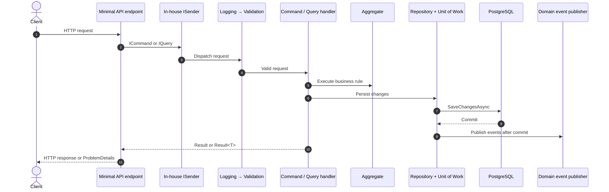
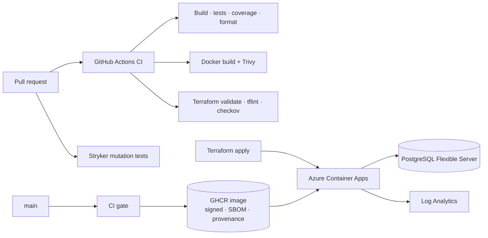

# Development and delivery guide

[Overview](../README.md) · [API and authentication](api-guide.md) · [Decisions](adr/README.md)

## Versions

Versions: [packages](../Directory.Packages.props), [SDK](../global.json), [tools](../.config/dotnet-tools.json). Compose: PostgreSQL **17**, Redis **8**, Keycloak **26.7**; Terraform defaults to PostgreSQL **16**.

## Project dependencies

The [overview figure](assets/architecture-layers.svg) shows selected paths; this table lists **every direct project reference** for the five business/API layers:

| Project | Owns | Direct project references |
|---|---|---|
| `SharedKernel` | Results, entities, common abstractions, mediator primitives | None |
| `Domain` | Aggregates, value objects, repository contracts, business rules and events | `SharedKernel` |
| `Application` | Commands, queries, handlers, validation and event handlers | `Domain`, `SharedKernel` |
| `Infrastructure` | EF Core, repositories, current user, time and cache configuration | `Application`, `Domain`, `SharedKernel` |
| `Presentation` | HTTP endpoints, auth, OpenAPI and composition root | `Application`, `Infrastructure`, `Domain`, `SharedKernel`, `ServiceDefaults` |

- Architecture tests reject outward references and convention violations.
- Domain rules stay independent of HTTP and storage frameworks.
- Order lines hold product IDs and name/price snapshots, so catalog updates cannot rewrite purchase history.

## Request flow

A write crosses the layers in this order; queries use repository/cache reads instead of changing aggregates or saving.



Expected failures return typed results; exceptions are handled globally. The in-house mediator runs the pipeline, and an EF interceptor publishes events **after saving** ([limitations](../docs/adr/0006-domain-events-via-savechanges-interceptor.md)).

## Project map

```text
src/
├── CleanArchitecture.SharedKernel      # Results, entities, mediator
├── CleanArchitecture.Domain            # Product and Order aggregates, domain rules
├── CleanArchitecture.Application       # Use cases and pipeline behaviors
├── CleanArchitecture.Infrastructure    # EF Core, PostgreSQL, repositories
├── CleanArchitecture.Presentation      # Minimal API, OpenAPI, Scalar
├── CleanArchitecture.ServiceDefaults   # OTel, discovery, resilience
└── CleanArchitecture.AppHost           # Aspire orchestration
tests/
├── *.UnitTests                         # Layer-focused tests
├── CleanArchitecture.IntegrationTests  # HTTP end to end against real PostgreSQL + OpenAPI contract snapshot
├── CleanArchitecture.ArchitectureTests # Dependency and convention rules
└── load/                               # k6 load test against the Compose stack
deploy/keycloak/                        # Local Keycloak realm as code (dev only)
terraform/                              # Azure Container Apps + PostgreSQL
```

## Quality gates

Run from the repository root; Docker is required for PostgreSQL integration tests.

```bash
dotnet build CleanArchitecture.slnx
dotnet test CleanArchitecture.slnx
dotnet format CleanArchitecture.slnx --verify-no-changes
```

| Gate | Coverage |
|---|---|
| Build | Nullable enabled, analyzers, deterministic output, warnings as errors |
| Tests | Six test projects; measured results in CI logs and coverage artifacts |
| Coverage | CI fails below 85 % line or 80 % branch coverage |
| Contract | The OpenAPI document must match [`openapi.v1.approved.json`](../tests/CleanArchitecture.IntegrationTests/OpenApi/openapi.v1.approved.json) |
| Mutation | Stryker.NET on Domain and Application; fails below a 60 % mutation score |
| Architecture | Layer, handler, repository, command/query, and mediator conventions |
| Performance | k6 load test (error rate and p95 thresholds) on a schedule or on demand |
| CI | Build, test, formatting, Docker build + Trivy scan, Terraform fmt + validate + tflint + checkov |
| Supply chain | Vulnerable NuGet package gate (incl. transitive), CodeQL (C# + workflows), signed images with SBOM and provenance, weekly grouped Dependabot updates |

Coverage values above are **required thresholds, not measured coverage**. For actual counts/coverage, open a [CI run](https://github.com/mbarretot/dotnet-clean-architecture/actions/workflows/ci.yml): its summary and `test-results` / `coverage-report` artifacts retain the evidence.

<details>
<summary><strong>Coverage report, contract snapshot, mutation and load commands</strong></summary>

Coverage report (HTML + Markdown summary in `TestResults/coverage-report`):

```bash
dotnet tool restore && dotnet test CleanArchitecture.slnx --coverage --coverage-output-format cobertura --coverage-settings CodeCoverage.config --results-directory TestResults && dotnet reportgenerator "-reports:TestResults/*.cobertura.xml" "-targetdir:TestResults/coverage-report" "-reporttypes:HtmlInline;Cobertura;MarkdownSummaryGithub"
```

```bash
# Approve an intended OpenAPI change (rewrites openapi.v1.approved.json)
UPDATE_SNAPSHOTS=1 dotnet test --project tests/CleanArchitecture.IntegrationTests

# Mutation testing (report in StrykerOutput/)
(
  cd tests/CleanArchitecture.Application.UnitTests
  dotnet stryker --project CleanArchitecture.Domain.csproj
  dotnet stryker --project CleanArchitecture.Application.csproj
)

# Load test against the Compose stack
docker compose up --detach --build --wait
k6 run tests/load/api-load.js
```

</details>

## Delivery



- Successful CI on `main` publishes SHA/`latest` GHCR images, signed with cosign and carrying SPDX SBOM/SLSA provenance.
- Workflow artifacts include CycloneDX SBOMs; Trivy reports go to code scanning.
- Terraform provisions Container Apps, PostgreSQL Flexible Server and Log Analytics; `cache_connection_string` connects existing Redis, not a newly provisioned instance.
- OTLP export requires `OTEL_EXPORTER_OTLP_ENDPOINT`.

<details>
<summary><strong>Verify a published image</strong></summary>

```bash
cosign verify ghcr.io/mbarretot/dotnet-clean-architecture:latest \
  --certificate-identity-regexp 'https://github.com/mbarretot/dotnet-clean-architecture/' \
  --certificate-oidc-issuer https://token.actions.githubusercontent.com
```

</details>

> [!WARNING]
> CD publishes images; **Azure rollout is manual**, and no live deployment is claimed. Terraform does not configure JWT or provision Keycloak. Set [identity](api-guide.md#production), secrets, networking and migration strategy before deploying.

Explore the [decision records](../docs/adr/README.md) for rationale, alternatives and known trade-offs.

